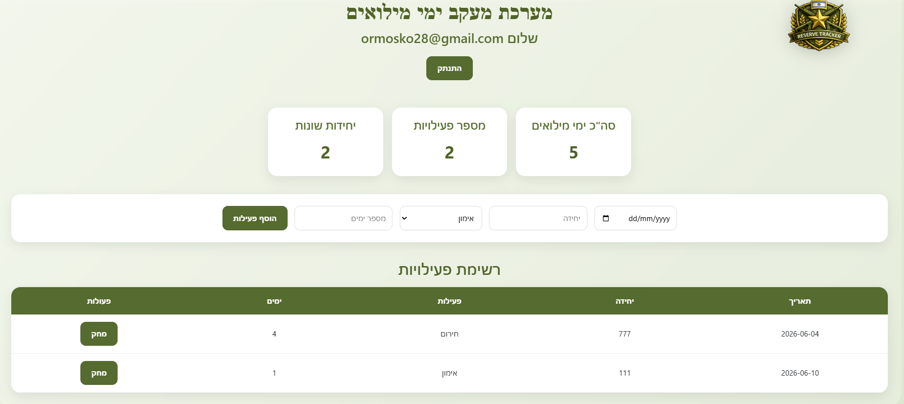

# 🪖 Reserve Tracker

## Military Reserve Duty Management System

A cloud-native serverless application built on AWS that enables users to track, manage, and analyze military reserve duty activities through a modern web interface.

---

## 🌐 Live Application

🔗 https://reserve-tracker-or-maoz.proj.rotem.click/

---

## 📖 Project Overview

Reserve Tracker was developed as part of a Cloud Computing course project.

The system allows users to:

✅ Log in using their email address

✅ Add reserve duty activities

✅ View personal activity history

✅ Track total reserve days

✅ View dashboard statistics

✅ Delete activities

✅ Store and retrieve data securely from AWS DynamoDB

---

# 🏗️ Architecture Diagram


---

## ☁️ AWS Architecture

The application follows a fully serverless architecture:

```text
User
 │
 ▼
Route 53
 │
 ▼
CloudFront
 │
 ▼
S3 Static Website
 │
 ▼
API Gateway
 │
 ▼
AWS Lambda
 │
 ▼
DynamoDB
```

### Additional Services

- GitHub Repository
- GitHub Actions CI/CD
- AWS IAM Roles & Policies
- AWS Certificate Manager (ACM)
- Amazon CloudWatch

---

# 📸 Application Screenshots

## Login Screen


---

## Dashboard



---

# 🚀 Features

### User Authentication

- Email-based login
- Personalized user data

### Activity Management

- Add reserve duty activities
- Delete activities
- View activity history

### Statistics Dashboard

- Total reserve days
- Total activities
- Unique units count

### Cloud Integration

- Serverless backend
- DynamoDB persistence
- API Gateway integration

---

# 🛠️ Technologies Used

## Frontend

- HTML5
- CSS3
- JavaScript

## Backend

- AWS Lambda (Node.js 22)

## Database

- Amazon DynamoDB

## AWS Services

- Amazon S3
- Amazon CloudFront
- Amazon Route 53
- AWS Certificate Manager (ACM)
- Amazon API Gateway
- AWS Lambda
- Amazon DynamoDB
- AWS IAM
- Amazon CloudWatch

## DevOps

- GitHub
- GitHub Actions
- CI/CD Pipelines

---

# 🔄 CI/CD Pipeline

The project includes automated deployment using GitHub Actions.

### Deployment Flow

```text
Developer
    │
    ▼
 GitHub Repository
    │
    ▼
 GitHub Actions
    │
    ▼
 Amazon S3
    │
    ▼
 CloudFront
    │
    ▼
 Live Website
```

### Pipeline Tasks

- Checkout Repository
- Configure AWS Credentials
- Deploy Website Files to S3
- Automatic Update of Production Website

---

# 🔐 Security

### AWS IAM

The project uses IAM Roles and Policies to provide secure access between AWS services.

### ACM

SSL/TLS certificates are managed using AWS Certificate Manager.

### HTTPS

The application is served securely through CloudFront using HTTPS.

---

# 📊 Monitoring

Monitoring and logging are handled through:

- Amazon CloudWatch Logs
- Lambda Monitoring
- API Gateway Monitoring
- CloudFront Metrics

---

# 🗄️ DynamoDB Schema

| Attribute | Type |
|------------|--------|
| soldierId | String |
| email | String |
| date | String |
| unit | String |
| activity | String |
| days | Number |

---

# 📡 API Endpoints

| Method | Endpoint |
|----------|----------|
| GET | /activities |
| POST | /activity |
| DELETE | /activity/{id} |
| OPTIONS | /activity |

---

# 👨‍💻 Authors

### Or Moskovich

Information Systems Student

---

### Maoz Nacjom

Information Systems Student

---

# 🎓 Academic Project

Cloud Computing Course

Yezreel Valley College (YVC)

2026
