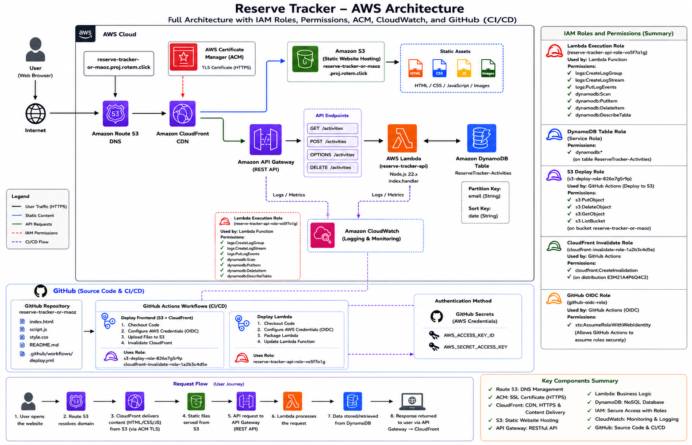

# Reserve Tracker

A cloud-native AWS application for tracking military reserve duty activities, built using a serverless architecture and modern DevOps practices.

---

## Project Overview

Reserve Tracker is a web-based system that allows users to manage and track reserve duty activities.

Users can:

- Log in using an email address
- Add reserve duty activities
- View personal activity history
- Track total reserve days
- View dashboard statistics
- Delete activities
- Store and retrieve data from AWS DynamoDB

The application is fully hosted on AWS and deployed automatically through GitHub Actions CI/CD pipelines.

---

# Architecture Diagram



---

# AWS Services Used

| Service | Purpose |
|----------|----------|
| Amazon Route 53 | DNS Management |
| AWS Certificate Manager (ACM) | SSL/TLS Certificate |
| Amazon CloudFront | Content Delivery Network (CDN) |
| Amazon S3 | Static Website Hosting |
| Amazon API Gateway | REST API |
| AWS Lambda | Business Logic |
| Amazon DynamoDB | Data Storage |
| AWS IAM | Roles and Permissions |
| Amazon CloudWatch | Monitoring and Logging |
| GitHub Actions | CI/CD Automation |

---

# System Architecture

The application follows a serverless architecture:

```text
User
 ↓
Route53
 ↓
CloudFront
 ↓
S3 Static Website
 ↓
API Gateway
 ↓
Lambda
 ↓
DynamoDB
```

---

# Frontend

The frontend is built using:

- HTML5
- CSS3
- JavaScript

Features:

- Email login
- Activity management
- Dashboard statistics
- Activity history table
- Responsive design
- Modern UI with glassmorphism effects

Hosted in:

```text
Amazon S3
```

Delivered globally through:

```text
Amazon CloudFront
```

---

# Backend

The backend is implemented using:

```text
AWS Lambda (Node.js 22.x)
```

The Lambda function handles:

### GET /activities

Returns all activities belonging to the logged-in user.

### POST /activity

Creates a new reserve activity.

### DELETE /activity/{id}

Deletes an existing activity.

### OPTIONS

Handles CORS requests.

---

# Database

Data is stored in:

```text
Amazon DynamoDB
```

Table:

```text
ReserveTracker
```

Attributes:

| Attribute | Type |
|------------|--------|
| soldierId | String |
| email | String |
| date | String |
| unit | String |
| activity | String |
| days | Number |

---

# API Endpoints

| Method | Endpoint |
|----------|----------|
| GET | /activities |
| POST | /activity |
| DELETE | /activity/{id} |
| OPTIONS | /activity |

---

# Security

The project uses multiple AWS security services.

## Route 53

Provides DNS routing for the custom domain.

## ACM

Provides HTTPS certificates for secure communication.

## IAM Roles

### Lambda Execution Role

Permissions:

- CloudWatch Logs access
- DynamoDB Scan
- DynamoDB PutItem
- DynamoDB DeleteItem
- DynamoDB DescribeTable

### GitHub Deployment User

Permissions:

- S3 Upload
- S3 Delete
- S3 List Bucket
- CloudFront Deployment Support

### GitHub Actions

Used for automatic deployment from GitHub to AWS.

---

# CI/CD Pipeline

The project includes automated deployment using GitHub Actions.

## Frontend Deployment

The workflow automatically:

1. Checks out the repository
2. Configures AWS credentials
3. Uploads website files to S3
4. Updates the hosted website

Deployment target:

```text
Amazon S3
```

---

# Monitoring

Monitoring is provided through:

```text
Amazon CloudWatch
```

Collected logs:

- Lambda Logs
- API Gateway Requests
- CloudFront Metrics
- DynamoDB Metrics

---

# User Flow

1. User accesses the website
2. Route 53 resolves the custom domain
3. CloudFront serves the website
4. Static files are loaded from S3
5. API requests are sent to API Gateway
6. Lambda processes the request
7. DynamoDB stores or retrieves data
8. Response is returned to the user

---

# Technologies

## Frontend

- HTML
- CSS
- JavaScript

## Backend

- Node.js 22.x
- AWS Lambda

## AWS Services

- Route 53
- ACM
- CloudFront
- S3
- API Gateway
- DynamoDB
- IAM
- CloudWatch

## DevOps

- GitHub
- GitHub Actions
- CI/CD

---

# Project URL

https://reserve-tracker-or-maoz.proj.rotem.click/

---

# Authors

**Or Moskovich**  
**Maoz Nachom**

Cloud Computing Project  
Yezreel Valley College (YVC)
